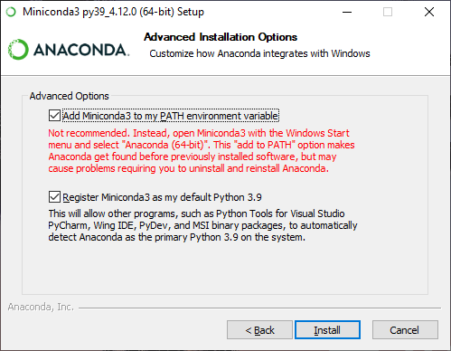
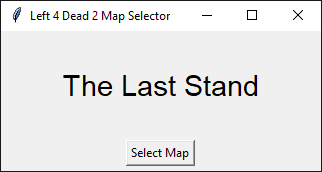

# l4d2-map-selector
Left 4 Dead 2 Map Selector

## 1. Download

Click the link below to download the latest version of the source code:

> GitHub Release: https://github.com/syenlxyz/l4d2-map-selector/releases

## 2. Conda Installation

### a. Quick Installation

Double-click `install.bat` to perform a one-time installation of Miniconda.

> Do not close the command prompt until you see `Press any key to continue . . .` (it means that the installation is complete).

### b. Manual Installation

You can find the latest version of Anaconda/Miniconda installers in the links below:

> Anaconda Installer: https://www.anaconda.com/

> Miniconda Installer: https://docs.conda.io/en/latest/miniconda.html

During the installation, make sure you have selected both advanced options as shown below:

## 3. Python Setup

If you are running this program for the first time, double-click `setup.bat` to perform a one-time setup for the program.

> Do not close the command prompt until you see `Press any key to continue . . .` (it means that the setup is complete).

## 4. Usage

Double-click `run.bat` to execute the program.

> Do not close the command prompt when the program is still in use (closing the command prompt will close the program).

Preview:

